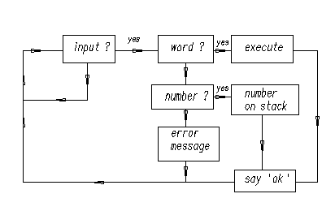
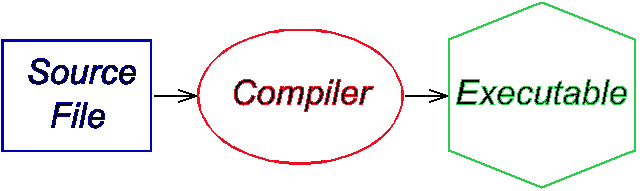
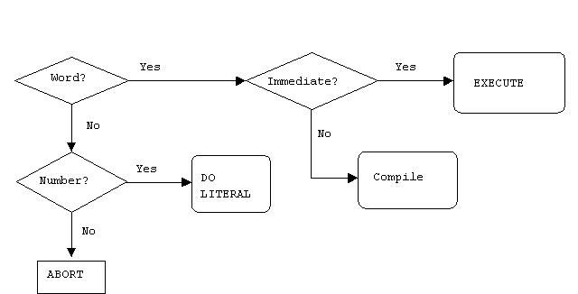

Please links to [the original](http://galileo.phys.virginia.edu/classes/551.jvn.fall01/primer.htm)
and only refer to this as a mirror.
{: .host-note }

# A Beginner's Guide to Forth

by J.V. Noble
{: .author }

[TOC]

## 1. Preliminaries

Forth is an unusual computer language that has probably been applied to more
varied projects than any other. It is the obvious choice when the project is
exceptionally demanding in terms of completion schedule, speed of execution,
compactness of code, or any combination of the above.

It has also been called "...one of the best-kept secrets in the computing
world." This is no exaggeration: large corporations have purchased professional
Forth development systems from vendors such as Laboratory Microsystems, Inc.,
Forth, Inc. or MicroProcessor Engineering, Ltd. and sworn them to secrecy.

Some speculate (unkindly) that corporate giants prefer to hide their shame at
using Forth; but I believe they are actually concealing a secret weapon from
their rivals. Whenever Forth has competed directly with a more conventional
language like C it has won hands down, producing smaller, faster, more reliable
code in far less time. I have searched for examples with the opposite outcome
but have been unable to find a single instance.

## 2. Getting started

We will use [Win32Forth](https://win32forth.sourceforge.net/) for these
illustrations. Download the file

    w32for42.exe

and double-click on it to install on any Windows 95, 98, NT, ME, or XP
–equipped machine.

The compressed files will then decompress themselves. They should also install
a program group on your desktop.

Now start Win32Forth by opening the program group and clicking on the
appropriate icon.

It should respond by opening a window and writing something like

    32bit Forth for Windows 95, and NT
    Compiled: July 23rd, 1997, 5:11pm
    Version: 3.5  Build: 0008  Release Build
    Platform: Windows 95 Version: 4.0  Build: 16384
    491k bytes free
    2,719 Words in Application dictionary
    1,466 Words in System dictionary
    4,185 Words total in dictionaries
    8,293 Windows Constants available

    Loading Win32For.CFG

    *** DON'T PANIC, Press: F1 NOW! ***

You can use UPPER or lower-case to type commands and data. Win32Forth
is case-insensitive.

You can also start the WinView editor by clicking on its icon in the program
group. The features of the editor are fairly standard and self-explanatory.
Make sure to set the preferences (Ctl-Shift-P or use the Edit drop-down menu)
to your own liking. Among other things, WinView is written in Forth (the
complete source is included) and is integrated with Win32Forth so that
compiling errors pop up in the editor.

## 3. The structure of Forth

In the Win32Forth window, now type

    BYE <cr>

The Win32Forth window immediately closes.

What just happened? Forth is an _interactive_ programming language consisting
entirely of subroutines, called words in Forth jargon.

Interactive means you type things in at the keyboard and the machine responds.
We will see some details of how it does this below.

A word is executed (interactively) by naming it. We have just seen this happen:
`BYE` is a Forth subroutine meaning "exit to the operating system". So when we
typed `BYE` <cr>, `BYE` was executed, and the system returned control to
Windows.

Click on the Win32Forth icon again to restart Forth. Now we will try something
a little more complicated. Enter:

    2 17  +  .  <cr> 19  ok

What happened? Forth is interpretive. A small program called the "outer
interpreter" continually loops, waiting for input from the keyboard or from a
mass storage device. The input is a sequence of text strings (words or numbers)
separated from each other by the standard Forth delimiter: one or more ASCII
blank (32decimal = 20hex) characters.

The text strings can be interpreted in only three ways: words (subroutine
names), numbers, or "not defined".

The outer interpreter tries first to look for an incoming word in the
_dictionary_ (a list of already-defined subroutine names). If it finds that
word, the interpreter executes the corresponding code.

If no dictionary entry exists, the interpreter tries to read the input as a
number. If the string satisfies the rules defining a number, it is converted to
a number in the machine's internal representation, and stored in a special
memory location, called "the top of the stack" (_TOS_).

In the above example, Forth interpreted `2` and `17` as numbers, and pushed
them both onto the stack.

`+` is a pre-defined word as is `.`, so they were looked up and executed.

`+` added 2 to 17 and left `19` on the stack.

The word `.` (called "dot") removed `19` from the stack and displayed it on the
standard output device (in this case, CRT).

The diagram below is a flow chart representing the actions performed by the
Forth outer interpreter during interpretation.

We might also have said:

    HEX    0A  14  * . <cr>  C8 ok

(Do you understand this? Hint: `DECIMAL` means "switch to decimal arithmetic",
whereas `HEX` stands for "switch to hexadecimal arithmetic".)

If the incoming text can neither be located in the dictionary nor interpreted
as a number, Forth issues an error message. Try it: type `X <cr>` and see

    X
    Error: X is undefined

or type `THING <cr>` and see

    THING
    Error: THING is undefined

Finally, here is the obligatory "Hello, World!" program. Forth lets you output
text using the word `."` as follows (we will explain in §4 below what `:` and
`;` mean):

    : hi     ." Hello, World!"  ;  ok

Now type in `hi` and see what happens:

    hi Hello, World! ok

This can be elaborated with words that tab, emit carriage returns, display in
colors, etc. but that would take us too far afield.

(The word `."` means "Display the string, following the obligatory blank space
and terminated by the close-quote `"` on the standard output device.")

Forth belongs to the class of Threaded Interpretive Languages. This means it
can interpret commands (subroutines or programs) typed in at the console, as
well as create (compile) new subroutines and programs. The compiler in a
traditional language has the structure shown below:

To compile and test a program in a traditional language such as Fortran, C or
Pascal, one prepares an input (source) file, submits it to a black box that
someone else created (the compiler) and then runs the resulting executable file
(which is generally in machine language). This process can be so tedious that
most program development in traditional languages must be supported by an
elaborate set of programs called the "environment", consisting of integrated
editors, debuggers, version control catalogues and the like.

The outer interpreter/compiler of a Forth system looks like this:

Forth has little in common with the traditional compilation method. Although
the Forth interpreter/compiler diagrammed above looks complicated, it is
simplicity itself compared with the contents of the oval blob representing a
traditional black-box compiler.

A continuous loop waits for input—from the keyboard, a disk file or
whatever—and acts on it according to its nature. Input consists of a sequence
of words and numbers. If a name is recognized it is executed; if it is not in
the dictionary (where else would you keep a list of words?) Forth tries to
convert it to a number and push it on the stack. If this is impossible, Forth
aborts execution, issues an error message and waits for more input.

As we shall see below, what makes Forth a compiler as well as an interpreter is
the set of words (Forth subroutines) that, when they are typed in and executed,
create new Forth subroutines.

## 4. Extending the dictionary

The compiler is one of Forth's most endearing features. Unlike most other
high-level languages, the Forth compiler is part of the language. (LISP and its
dialects also make components of the compilation mechanism available to the
programmer.) That is, its components are Forth words available to the
programmer, that can be used to solve his problems.

In this section we discuss how the compiler extends the dictionary. As noted
above, normally a Forth system awaits input, and interprets (and executes it).
We say the system is normally in _interpret_ mode.

Forth uses special words to create new dictionary entries, i.e., new words. The
most important are `:` ("start a new definition") and `;` ("terminate the
definition").

Let's try this out: enter

    : *+    *  +  ;  <cr>  ok

What happened? The word `:` was executed because it was already in the
dictionary. The action of `:` is:

 - Create a new dictionary entry named `*+` and switch from _interpret_ to
   _compile_ mode.
 - In _compile_ mode, the interpreter looks up words and—rather than executing
   them—installs pointers to their code. (If the text is a number, instead of
   pushing it on the stack, Forth builds the number into the dictionary space
   allotted for the new word, following special code that puts the stored
   number on the stack whenever that word is executed.)
 - The action of `*+` is thus to execute sequentially the previously-defined
   words `*` and `+`.
 - The word `;` is special: when it was defined a bit was turned on in its
   dictionary entry to mark it as `IMMEDIATE`. Thus, rather than writing down
   the address of `;`, the compiler executes `;` immediately. (That is, an
   `IMMEDIATE` word is always executed, even if the system is in compile mode.)

What `;` does is twofold: first, it installs the code that returns control to
the next outer level of the interpreter; and second, it switches back from
compile mode to _interpret_ mode.

Now try out `*+`:

    DECIMAL   5 6 7 *+ .  <cr>  47  ok

This example illustrated two principles of Forth: adding a new word to the
dictionary, and trying it out as soon as it was defined.

The diagram below is a flow chart representing the actions performed by the
Forth inner interpreter during compilation.

Any word you have added to the dictionary can be decompiled using the Forth
word `SEE`. Say:

    SEE *+  <cr>

and get:

    SEE *+
    : *+    * + ;  ok

This can be useful when trying to understand how something works.

## 5. Stacks and reverse Polish notation (RPN)

We now discuss the stack and the "reverse Polish" or "postfix" arithmetic based
on it. (Anyone who has used a Hewlett-Packard calculator should be familiar
with the concept.)

Virtually all modern CPU's are designed around stacks. Forth efficiently uses
its CPU by reflecting this underlying stack architecture in its syntax.

But what _is_ a stack?  As the name implies, a stack is the machine analog of a
pile of cards with numbers written on them. Numbers are always added to the top
of the pile, and removed from the top of the pile. The Forth input line:

    2 5 73 -16 <cr> ok

leaves the stack in the state:

    cell #   contents

      0       -16        (TOS)
      1        73        (NOS)
      2         5
      3         2

where TOS stands for "top-of-stack", NOS for "next-on-stack", etc.

We usually employ zero-based relative numbering in Forth data structures (such
as stacks, arrays, tables, etc.) so TOS is given relative #0, NOS #1, etc.

Suppose we followed the above input line with the line

    + - * . <cr> xxx ok

what would `xxx` be? The operations would produce the successive stacks

    cell#  initial     +      -       *      .
           stack

      0      -16      57        -52       -104
      1       73       5          2
      2        5       2
      3        2                                   empty  ( 104 -> CRT )
                                                   stack

The operation `.` (TOS->display) displays -104 to the screen, leaving the stack
empty. That is, `xxx` is -104.

### a. Manipulating the parameter stack

Forth systems incorporate (at least) two stacks: the parameter stack and the
return stack.

A stack-based system must provide ways to put numbers on the stack, to remove
them, and to rearrange their order. Forth includes standard words for this
purpose.

Putting numbers on the stack is easy: simply type the number (or incorporate it
in the definition of a Forth word).

The word `DROP` removes the number from TOS and moves up all the other numbers.
(Since the stack usually grows downward in memory, `DROP` merely increments the
pointer to TOS by 1 cell.)

`SWAP` exchanges the top 2 numbers.

`DUP` duplicates the TOS into NOS.

`ROT` rotates the top 3 numbers.

These actions are shown below (we show what each word does to the initial
stack):

    cell | initial | DROP    SWAP     ROT      DUP

      0  |   -16   |  73      73        5      -16
      1  |    73   |   5     -16      -16      -16
      2  |     5   |   2       5       73       73
      3  |     2   |           2        2        5
      4  |         |                             2

Forth includes the words `OVER`, `TUCK`, `PICK` and ROLL that act as shown
below (note: `PICK` and `ROLL` must be preceded by an integer that says where
on the stack an element gets `PICK`'ed or `ROLL`'ed):

    cell | initial | OVER    TUCK    3 PICK    3 ROLL

      0  |   -16   |  73      -16        2        2
      1  |    73   | -16       73      -16      -16
      2  |     5   |  73      -16       73       73
      3  |     2   |   5        5        5        5
      4  |         |   2        2        2

Clearly, `0 PICK` is the same as `DUP`, `1 PICK` is a synonym for `OVER`, `1
ROLL` means `SWAP` and `2 ROLL` means `ROT`.

The words `PICK` and `ROLL` are mainly useful for dealing with deep stacks. But
the current trend in Forth programming is to avoid making the stack deeper than
3 or 4 elements. A deeper stack than that is generally considered a sign that
the program has been insufficiently thought out and needs to be
[factored](https://users.ece.cmu.edu/~koopman/forth/hopl.html).

### b. Remarks on factoring

**Factoring** is the process of breaking out repeated pieces of code from
subroutines and giving them a name. This not only shortens the overall program
but can make the code simpler. Here is a frequently offereded illustration:

    : SUM-OF-SQUARES   ( a b -- a*a+b*b )   DUP *   SWAP   DUP *  +  ;

has the repeated phrase `DUP *` and can be replaced profitably by:

    : SQUARED   ( a -- a*a )     DUP *  ;

    : SUM-OF-SQUARES   ( a b -- a*a+b*b )
         SQUARED            ( -- a b*b)
         SWAP               ( -- b*b a)
         SQUARED            ( -- b*b a*a)
         +                  ( -- b*b + a*a)
    ;

The new version of `SUM-OF-SQUARES` is 2 words shorter and thus easier to read.

Before leaving this subject I would like to offer some deeper examples of
factoring, plus a badly factored definition. To begin with the badly factored
word, look at the file `float.f` in the Win32Forth main directory, and in
particular at the word `>float`. This word is almost 3 pages long, which makes
it virtually impossible to read or to maintain.

Here is an example of where factoring leads to great simplification. My linear
equations solver uses Gaussian elimination with row-pivoting. By appropriate
transformations the equations are put in the form of equations with an
upper-triangular matrix. Once this is done the equations can be solved for
xk beginning with the _n_'th (which only requires a single division
to determine the unknown xn); the _n_-1'st can then be solved by
equally simple algebra in terms of xn, etc. This procedure is called
"back-solving" because it proceeds in reverse order. The word that does the all
the work expects addresses of matrix and inhomogeneous term on the data stack:

    : }}solve     ( A{{  V{ --)
      initialize  triangularize  back-solve  report ;

You will note that the words `initialize`, `triangularize`, `back-solve` and
`report` were given names that tell you precisely what they do. They represent
the major steps of the algorithm as described above. Of course they have to be
defined _before_ they can be invoked. This is why we describe the typical Forth
programming style as "bottom-up" rather than "top-down" as with other
languages.

My final example of factoring is a routine for adaptive numerical quadrature
(integrating a function of one variable) based on [Simpson's
Rule](https://en.wikipedia.org/wiki/Simpson%27s_rule). To use it one says:

    use( fn.name xa xb err )integral

The algorithm computes the integral on an interval, then breaks it into two
equal sub-intervals. The sub-integrals are compared with the original—if they
agree within the tolerance the result is accumulated and the integral is
evaluated on the remainder of the interval. If they don't agree the routine
works on the upper sub-interval until convergence is achieved.

    : )integral    ( f: xa xb err -- I[xa,xb]) ( xt --)
         initialize
         BEGIN                   \ begin indefinite loop
            subdivide               \ break last subinterval in two
            converged?
            IF    interpolate       \ apply Richardson interpolation
                  shrink-interval
            THEN
         none-left  UNTIL        \ loop until done
         TotIntegral  F@         ( f: -- Integral)  \ leave result
    ;

This version has been reduced to seven basic operations, not counting the
system words `BEGIN`, `UNTIL` that set up the loop; `IF`...`THEN` that sets up
the branch, and `F@` that puts the answer on the stack.

### c. The return stack and its uses

We have remarked above that compilation establishes links from the calling word
to the previously-defined word being invoked. The linkage mechanism—during
execution—uses the return stack (rstack): the address of the next word to be
invoked is placed on the rstack, so that when the current word is done
executing, the system knows to jump to the next word. (This is so in most, but
not all, modern Forth implementations. But all have a return stack, whether or
not they use them for linking subroutines.)

In addition to serving as a reservoir of return addresses (since words can be
nested, the return addresses need a stack to be put on) the rstack is where the
limits of a `DO`...`LOOP` construct are placed.

The user can also store/retrieve to/from the rstack. This is an example of
using a component for a purpose other than the one it was designed for. Such
use is discouraged for novices since it adds the spice of danger to
programming. See "Note of caution" below.

To store to the rstack we say `>R`, and to retrieve we say `R>`. The word `R@`
copies the top of the rstack to the TOS.

Why use the rstack when we have a perfectly good parameter stack to play with?
Sometimes it becomes hard to read code that performs complex gymnastics on the
stack. The rstack can reduce the complexity.

Alternatively, `VARIABLE`s—named locations—provide a place to store
numbers—such as intermediate results in a calculation—off the stack, again
reducing the gymnastics. Try this:

    \ YOU DO THIS            \ EXPLANATION

    VARIABLE X <cr>  ok      \ create a named storage location X;
                             \ X executes by leaving its address

    3 X ! <cr>  ok           \ ! ("store") expects a number and
                             \ an address, and stores the number to
                             \ that address

    X @  . <cr>  3 ok        \ @ ("fetch") expects an address, and
                             \ places its contents in TOS.

However, Forth encourages using as few named variables as possible. The reason:
since `VARIABLE`s are typically global—any subroutine can access them—they can
cause unwanted interactions among parts of a large program.

Although Forth can make variables _local_ to the subroutines that use them (see
"headerless words" in FTR), the rstack can often replace local variables:

- The rstack already exists, so it need not be defined anew.
- When the numbers placed on it are removed, the rstack shrinks, reclaiming
  some memory.

**A note of caution:** since the rstack is critical to execution we mess with
it at our peril. If we use the rstack for temporary storage we must restore it
to its initial state. A word that places a number on the rstack must remove
it—using `R>` or `RDROP` (if it has been defined)—before exiting that word.
Since `DO`...`LOOP` also uses the rstack, for each `>R` following `DO` there
must be a corresponding `R>` or `RDROP` preceding `LOOP`. Neglecting these
precautions will probably crash the system.

`RDROP` is not an ANS Forth word that can be assumed predefined on any system.
Since it is not Standard, some systems call it `R>DROP` (which also is not
Standard). Here is its definition if needed:

    : RDROP   ( or R>DROP)   ( r: n -- )  R>  DROP  ;

### d. Local variables and VALUEs

I mentioned `VARIABLE`s above—a `VARIABLE` is a subroutine whose action is to
return the address of a named, cell-sized memory location, as in:

    VARIABLE x
    x . 247496  ok   ( it doesn't have to be this address!)
    -49 x !
    x @ .  -49  ok

A `VALUE` is a widely used hybrid of `VARIABLE` and `CONSTANT` (see below). We
define and initialize a `VALUE` as we would a `CONSTANT`:

    13 VALUE  thirteen    ok

We invoke the new `VALUE` just as we would a `CONSTANT`:

    thirteen  .  13  ok

However, we can change a `VALUE` as though it were a `VARIABLE`:

    47  TO  thirteen  ok
    thirteen  .  47  ok

Needless to say, the word `TO` also works within word definitions, replacing
the `VALUE` that follows it with whatever is currently in TOS. (Note that it
would be dangerous to follow `TO` with anything but a `VALUE`!!) `VALUE`s are
part of the ANS Forth `CORE EXTENSION` wordset (that is, the corresponding code
is not guaranteed to be loaded on minimal ANS-compliant systems).

This is a good time to mention that Forth does no type-checking (unless you add
it yourself). **You** must check that `TO` is followed by a `VALUE` and not
something else.

ANS Forth also includes a `LOCALS EXTENSION` wordset that implements named
memory locations local to a word definition. Locals are generally dynamic in
nature (that is, their memory is reclaimed upon exiting the word), although the
Standard does not insist on this. A commonly used syntax is `LOCALS| a b c ...
|`, as in this definition (from a line-drawing algorithm):

    : v+    ( a b c d -- a+c b+d)
        LOCALS| d c b a |
        a c +  b d +  ;

    2 3 4 5 v+ .S [2] 6 8  ok..  ( .S displays the stack without destroying it)

The important things to remember are:

 - the names `a, b, c ...` can be any Forth-acceptable strings;

 - the local names have meaning only within a word definition;

 - the locals are initialized from the stack as shown in `v+` above, and as in
   the next example:

        : test-locals  ( a b c -- )
            LOCALS| c b a |
            CR  ." Normal order: " a .  b .  c .
            CR  ." Stack order:  " c .  b .  a .
            13 TO a   14 TO b  15 TO c  \ how TO works
            CR ." Changed: " a . b . c
        ;  ok

        3 4 5 test-locals
        Normal order: 3 4 5
        Stack order:  5 4 3
        Changed:  13 14 15  ok

 - the locals act like `VALUE`s, not like `VARIABLE`s, as the above example
   makes clear;

 - the `LOCALS EXTENSION` wordset requires `LOCALS| ... |` to accomodate (at
   least) 8 local names.

`LOCALS| ... |` is never necessary, nor does it necessarily shorten code, as
the example below makes clear (7 words as opposed to 6 + preamble):

    : v+   ( a b c d -- a+c b+d)  2>R   R>  +  SWAP  R>  +  SWAP  ;

What it does accomplish is to reduce stack juggling and clarify the code in
some cases.

## 6. Using memory

As we just saw, ordinary numbers are fetched from memory to the stack by `@`
("fetch"), and stored by `!` (store).

`@` expects an address on the stack and replaces that address by its contents
using, e.g., the phrase `X  @`

`!` expects a number (NOS) and an address (TOS) to store it in, and places the
number in the memory location referred to by the address, consuming both
arguments in the process, as in the phrase  `3 X  !`

Double length numbers can similarly be fetched and stored, by `D@` and `D!`, if
the system has these words.

Positive numbers that represent characters can be placed in character-sized
cells of memory using `C@` and `C!`. This is convenient for operations with
strings of text, for example screen and keyboard I/O.

Of course, one cannot put numbers in memory or retrieve them, for that matter,
without a means of allocating memory and of assigning labels to the memory so
allocated.

The Forth subroutines `CREATE` and `ALLOT` are the basic tools for setting
aside memory and attaching a convenient label to it. As we shall see below,
`CREATE` makes a new dictionary entry, as in

    CREATE X

Here the new entry has the name `X`, but it could have been "Joe" or anything
else. The new name is a Forth subroutine that will return the address of the
next available space in memory. Thus:

    CREATE X  ok
    X . 247316  ok
    HERE . 247316  ok

`HERE` is a subroutine that returns the address of the next available space—we
note that it is the same as the address of `X` because no space has been
`ALLOT`ted. We can rectify this by saying

    10 CELLS ALLOT  ok

and checking with

    HERE . 247356  ok

We see that the next available space is now marked as 40 bytes further up in
memory. (Each `CELL` is therefore 4 bytes or 32 bits on this system.) In other
words, the subroutine `ALLOT` increases the pointer `HERE` by the number of
address units you have told it to allot. You could have said

    40 ALLOT

instead of

    10 CELLS ALLOT

but the latter is more portable because it frees you from having to revise your
code if you were to run it on a system with 64-bit or 16-bit cells (both of
which are in common use).

By executing the sequence

    CREATE X  10 CELLS ALLOT

we have set aside enough room to hold 10 32-bit numbers—for example a table or
array—that can be referenced by naming it. If we want to get at the 6th element
of the array (the first element has index 0, so the 6th has index 5) we would
say

    X  5 CELLS  +

to compute its address. To see how this works, let us say

    137  X 5 CELLS +  !  ok

to store an integer into the 6th array location; then

    X 5 CELLS +  @  . 137  ok

retrieves and displays it.

Using the tools provided by `CREATE` and `ALLOT` we can devise any sort of data
structure we like. This is why Forth does not provide a panoply of data
structures, such as are to be found in languages like C, Pascal or Fortran. It
is too easy in Forth to custom tailor any sort of data structure one wishes. In
the section on `CREATE`...`DOES>` below you will see that Forth makes it easy
to write subroutines ("constructors") that create custom data structures—that
can even include code fragments that do useful things. For example, a
`CONSTANT` is a number you would not want to change during a program's
execution. So you do not want access to its memory location. How then do you
get the number when you need it? You package the code for `@` with the storage
location, so that by naming the CONSTANT you retrieve its contents. Its usage
is

    17 CONSTANT seventeen  ok
    seventeen . 17  ok

## 7. Comparing and branching

Forth lets you compare two numbers on the stack, using relational operators
`>`, `<`, `=`. Thus, e.g., the phrase

    2 3 > <cr> ok

leaves 0 ("false") on the stack, because 2 (NOS) is not greater than 3 (TOS).
Conversely, the phrase

    2 3 < <cr> ok

leaves -1 ("true") because 2 is less than 3.

Note: In some Forths "true" is +1 rather than -1.

Relational operators consume both arguments and leave a "flag" to show what
happened.

(Many Forths offer unary relational operators `0=`, `0>` and `0<`. These, as
might be guessed, determine whether the TOS contains an integer that is 0,
positive or negative.)

The relational words are used for branching and control. For example,

    : TEST     0 =  INVERT  IF   CR   ." Not zero!"   THEN  ;

    0 TEST <cr>  ok     ( no action)
    -14 TEST <cr>
    Not zero!  ok

The TOS is compared with zero, and the `INVERT` operator (bitwise logical
NOT—this flips "true" and "false") is applied to the resulting flag. The word
`CR` issues a carriage return (newline). Finally, if TOS is non-zero, `IF`
swallows the flag and executes all the words between itself and the terminating
`THEN`. If TOS is zero, execution jumps to the word following `THEN`.

The word `ELSE` is used in the `IF`...`ELSE`...`THEN` statement: a nonzero
value in TOS causes any words between `IF` and `ELSE` to be executed, and words
between `ELSE` and `THEN` to be skipped. A zero value produces the opposite
behavior. Thus, e.g.

    : TRUTH    CR   0 =  IF  ." false"  ELSE  ." true"  THEN  ;

    1 TRUTH <cr>
    true  ok

    0 TRUTH <cr>
    false  ok

Since `THEN` is used to terminate an `IF` statement rather than in its usual
sense, some Forth writers prefer the name `ENDIF`.

## 8. Documenting and commenting Forth code

Forth is sometimes accused of being a "write-only" language, i.e. some complain
that Forth is cryptic. This is really a complaint against poor documentation
and untelegraphic word names. Unreadability is equally a flaw of poorly written
FORTRAN, Pascal, C, etc.

Forth offers programmers who take the trouble tools for producing exceptionally
clear code.

### a. Parenthesized remarks

The word `(`—a left parenthesis followed by a space—says "disregard all
following text until the next right parenthesis in the input stream". Thus we
can intersperse explanatory remarks within colon definitions.

### b. Stack comments

A particular form of parenthesized remark describes the effect of a word on the
stack. In the example of a recursive loop (GCD below), stack comments are
really all the documentation necessary.

Glossaries generally explain the action of a word with a stack-effect comment.
For example,

    ( adr -- n)

describes the word `@` ("fetch"): it says `@` expects to find an address (adr)
on the stack, and to leave its contents (n) upon completion. The corresponding
comment for `!` would be

    ( n adr -- ) .

### c. Drop line (`\`)

The word `\` (back-slash followed by space) has recently gained favor as a
method for including longer comments. It simply means "drop everything in the
input stream until the next carriage return". Instructions to the user,
clarifications or usage examples are most naturally expressed in a block of
text with each line set off by `\`.

### d. Comment blocks

ANS Forth contains interpreted `IF`...`THEN`, in the form of `[IF]`...`[THEN]`.
Although they are generally used for conditional compilation, these words
can be used to create comment blocks. Thus we can say

    FALSE [IF]   anything you want to say
    [THEN]

and the included remarks, code, examples or whatever will be ignored by the
compiling mechanism.

### e. Self-documenting code

By eliminating ungrammatical phrases like `CALL` or `GOSUB`, Forth presents the
opportunity—via telegraphic names for words—to make code almost as
self-documenting and transparent as a readable English or German sentence.
Thus, for example, a robot control program could contain a phrase like

    2 TIMES   LEFT EYE  WINK

which is clear (although it sounds like a stage direction for Brunhilde to vamp
Siegfried). It would even be possible without much difficulty to define the
words in the program so that the sequence could be made English-like: `WINK
LEFT EYE 2 TIMES`.

One key to doing this is to eliminate "noise" words like `@`, `!`, `>R`, etc.
by factoring them out into expressively named—and reuseable—subroutines.

Another is to organize the listing of a subroutine so that it physically
resembles what it is supposed to do. Two examples are the jump table defined
below, as well as a method for programming finite state automata.

## 9. Integer arithmetic operations

The 1979 or 1983 standards require that a conforming Forth system contain a
certain minimum set of pre-defined words. These consist of arithmetic operators
`+` `-` `*` `/` `MOD` `/MOD` `*/` for (usually) 16-bit signed-integer (-32767
to +32767) arithmetic, and equivalents for unsigned (0 to 65535), double-length
and mixed-mode (16- mixed with 32-bit) arithmetic. The list will be found in
the glossary accompanying your system, as well as in SF and FTR.

Try this example of a non-trivial program that uses arithmetic and branching to
compute the greatest common divisor of two integers using Euclid's algorithm:

    : TUCK   ( a b -- b a b)   SWAP  OVER  ;
    : GCD    ( a b -- gcd)  ?DUP  IF  TUCK  MOD  GCD  THEN  ;

The word `?DUP` duplicates TOS if it is not zero, and leaves it alone
otherwise. If the TOS is 0, therefore, `GCD` consumes it and does nothing else.
However, if TOS is unequal to 0, then `GCD` `TUCK`s TOS under NOS (to save it);
then divides NOS by TOS, keeping the remainder (`MOD`). There are now two
numbers left on the stack, so we again take the GCD of them. That is, `GCD`
calls itself.

If you try the above code it will fail. A dictionary entry cannot be looked up
and found until the terminating `;` has completed it. So in fact we must use
the word `RECURSE` to achieve self-reference, as in

    : TUCK   ( a b -- b a b)   SWAP  OVER  ;
    : GCD    ( a b -- gcd)  ?DUP  IF   TUCK  MOD  RECURSE   THEN  ;

Now try:

    784 48 GCD .  <cr>  16 ok

The ANSI/ISO Forth Standard (adopted in 1994) mandates the minimal set of
arithmetic operators `+` `-` `*` `/` `MOD` `*/` `/MOD` `*/MOD` and `M*`. The
standard memory-word size is the cell, which must be at least 16 bits, but in
many modern systems is 32- or even 64 bits wide. Single-length integers in
Win32Forth are 32 bits. The stack on ANS-compliant Forths is always 1 cell
wide.

## 10. Looping and structured programming

Forth has several ways to loop, including the implicit method of recursion,
illustrated above. Recursion has a bad name as a looping method because in most
languages that permit recursion, it imposes unacceptable running time overhead
on the program. Worse, recursion can—for reasons beyond the scope of this
Introduction to Forth—be an extremely inefficient method of expressing the
problem. In Forth, there is virtually no excess overhead in recursive calls
because Forth uses the stack directly. So there is no reason not to recurse if
that is the best way to program the algorithm. But for those times when
recursion simply isn't enough, here are some more standard methods.

### a. Indefinite loops

The construct

    BEGIN xxx ( -- flag)  UNTIL

executes the words represented by xxx, leaving TOS (flag) set to TRUE—at which
point `UNTIL` terminates the loop—or to FALSE—at which point `UNTIL` jumps back
to `BEGIN`. Try:

    : COUNTDOWN    ( n --)
         BEGIN  CR   DUP  .  1 -   DUP   0  =   UNTIL  DROP  ;

    5 COUNTDOWN
    5
    4
    3
    2
    1  ok

A variant of `BEGIN`...`UNTIL` is

    BEGIN xxx ( -- flag) WHILE  yyy  REPEAT

Here `xxx` is executed, `WHILE` tests the flag and if it is FALSE leaves the
loop; if the flag is TRUE, yyy is executed; `REPEAT` then branches back to
`BEGIN`.

These forms can be used to set up loops that repeat until some external event
(pressing a key at the keyboard, e.g.) sets the flag to exit the loop. They can
also used to make endless loops (like the outer interpreter of Forth) by
forcing the flag to be FALSE in a definition like

    : ENDLESS     BEGIN  xxx  FALSE  UNTIL ;

### b. Definite loops

Most Forths allow indexed loops using `DO`...`LOOP` (or step `+LOOP`). These
are permitted only within definitions

    : BY-ONES   ( n --)   0 TUCK  DO   CR  DUP  .  1 +  LOOP   DROP  ;

The words `CR  DUP  .  1 +` will be executed n times as the lower limit, 0,
increases in unit steps to n-1.

To step by 2's, we use the phrase `2 +LOOP` to replace `LOOP`, as with

    : BY-TWOS   ( n --)   0 TUCK
         DO   CR  DUP  .  2 +    2 +LOOP    DROP  ;

These words can be simplified by accessing the loop index with the word `I`:

    : BY-TWOS   ( n --)    0  DO   CR   I  .     2 +LOOP  ;

We can even count backwards, as in launching a rocket, as in

    : countdown   0 SWAP   DO  CR  I  .   -1  +LOOP  ;  ok

    10 countdown
    10
    9
    8
    7
    6
    5
    4
    3
    2
    1
    0  ok

One may also nest loops and access the index of the outer loop from the inner
loop using the word `J`, as in

    : NESTED    ( n m --)  CR
           0 DO  DUP  ( n n --)
                  0 DO  CR  J .  I .
                  LOOP
           LOOP
    DROP  ;

    2 3  NESTED

    0 0
    0 1
    1 0
    1 1
    2 0
    2 1  ok

Here is something to beware of: suppose the initial indices for the `DO` loop
are equal: that is, something like

    17  17  DO   stuff   LOOP

then the loop will be executed 232-1 times! As the ANS Standard document says,
"This is intolerable." Therefore ANS Forth defines a special word, `?DO`, that
will skip the loop if the indices are equal, and execute it if they are not. It
is up to the programmer to make sure that if the initial index exceeds the
final one, as in `0 17  DO`, the program counts down, assuming that is what was
intended:

    0 17  DO  stuff   -1  +LOOP

### c. Structured programming

N. Wirth invented the Pascal language in reaction to program flow charts
resembling a plate of spaghetti. Such flow diagrams were often seen in early
languages like FORTRAN and assembler. Wirth intended to eliminate line labels
and direct jumps (`GOTO`s), thereby forcing control flow to be clear and
direct.

The ideal was subroutines or functions that performed a single task, with
unique entries and exits. Unfortunately, programmers insisted on `GOTO`s, so
many Pascals and other modern languages now have them. Worse, the ideal of
short subroutines that do one thing only is unreachable in such languages
because the method for calling them and passing arguments imposes a large
overhead. Thus execution speed requires minimizing calls, which in turn means
longer, more complex subroutines that perform several related tasks. Today
structured programming seems to mean little more than writing code with nested
`IF`s indented by a pretty-printer.

Paradoxically, Forth is the only truly structured language in common use,
although it was not designed with that as its goal. In Forth word definitions
are lists of subroutines. The language contains no `GOTO`s so it is impossible
to write "spaghetti" code. Forth also encourages structure through short
definitions. The additional running time incurred in breaking a long procedure
into many small ones (this is called "factoring") is typically rather small in
Forth. Each Forth subroutine (word) has one entry and one exit point, and can
be written to perform a single job.

### d. "Top-down" design

"Top-down" programming is a doctrine that one should design the entire program
from the general to the particular:

 - Make an outline, flow chart or whatever, taking a broad overview of the
   whole problem.
 - Break the problem into small pieces (decompose it).
 - Then code the individual components.

The natural programming mode in Forth is "bottom-up" rather than "top-
down"—the most general word appears last, whereas the definitions must progress
from the primitive to the complex. This leads to a somewhat different approach
from more familiar languages:

- In Forth, components are specified roughly, and then as they are coded they
  are immediately tested, debugged, redesigned and improved.
- The evolution of the components guides the evolution of the outer levels of
  the program.

## 11. `CREATE`...`DOES>` (the pearl of FORTH)

Michael Ham has called the word pair `CREATE`...`DOES>`, the "pearl of Forth".
`CREATE` is a component of the compiler, whose function is to make a new
dictionary entry with a given name (the next name in the input stream) and
nothing else. `DOES>` assigns a specific run-time action to a newly `CREATE`d
word.

### a. Defining "defining" words

`CREATE` finds its most important use in extending the powerful class of Forth
words called "defining" words. The colon compiler  `:`  is such a word, as are
`VARIABLE` and `CONSTANT`.

The definition of `VARIABLE` in high-level Forth is simple

    : VARIABLE  CREATE   1 CELLS  ALLOT ;

We have already seen how `VARIABLE` is used in a program. An alternative
definition found in some Forths is

    : VARIABLE  CREATE   0  ,  ;

—these variables are initialized to 0.

Forth lets us define words initialized to contain specific values: for example,
we might want to define the number 17 to be a word. `CREATE` and `,` ("comma")
can do this:

    17 CREATE SEVENTEEN  ,  <cr>  ok

Now test it via

    SEVENTEEN @ .  <cr>  17 ok .

Remarks:

 - The word `,` ("comma") puts TOS into the next cell of the dictionary and
   increments the dictionary pointer by that number of bytes.
 - A word `C,` ("see-comma") exists also—it puts a character into the next
   character-length slot of the dictionary and increments the pointer by 1 such
   slot. (In the ASCII character representation the slots are 1 byte long;
   Unicode characters require 2 bytes.)

### b. Run-time vs. compile-time actions

In the preceding example, we were able to initialize the variable `SEVENTEEN`
to 17 when we `CREATE`d it, but we still have to fetch it to the stack via
`SEVENTEEN  @` whenever we want it. This is not quite what we had in mind. We
would like to find 17 in TOS when `SEVENTEEN` is named. The word `DOES>` gives
us the tool to do this.

The function of `DOES>` is to specify a run-time action for the "child" words
of a defining word. Consider the defining word `CONSTANT`, defined in
high-level (of course `CONSTANT` is usually defined in machine code for speed)
Forth by

    : CONSTANT  CREATE  ,  DOES>  @  ;

and used as

    53 CONSTANT PRIME  <cr> ok

Now test it:

    PRIME . <cr>  53  ok .

What is happening here?

 - `CREATE` (hidden in `CONSTANT`) makes an entry named `PRIME` (the first word
   in the input stream following `CONSTANT`). Then `,` places the TOS (the
   number 53) in the next cell of the dictionary.
 - Then `DOES>` (inside `CONSTANT`) appends the actions of all words between it
   and `;` (the end of the definition)—in this case, `@`—to the child word(s)
   defined by `CONSTANT`.

### c. Dimensioned data (intrinsic units)

Here is an example of the power of defining words and of the distinction
between compile-time and run-time behaviors.

Physical problems generally involve quantities that have dimensions, usually
expressed as mass (M), length (L) and time (T) or products of powers of these.
Sometimes there is more than one system of units in common use to describe the
same phenomena.

For example, U.S. or English police reporting accidents might use inches, feet
and yards; while Continental police would use centimeters and meters. Rather
than write different versions of an accident analysis program it is simpler to
write one program and make unit conversions part of the grammar. This is easy
in Forth.

The simplest method is to keep all internal lengths in millimeters, say, and
convert as follows:

    : INCHES  254   10  */ ;
    : FEET   [ 254 12 * ] LITERAL  10  */ ;
    : YARDS  [ 254 36 * ] LITERAL  10  */ ;
    : CENTIMETERS   10  * ;
    : METERS   1000  * ;

Note: This example is based on integer arithmetic.  The word `*/` means
"multiply the third number on the stack by NOS, keeping double precision, and
divide by TOS". That is, the stack comment for `*/` is `( a b c -- a*b/c)`.

The usage would be

    10 FEET  .  <cr>  3048 ok

The word `[` switches from compile mode to interpret mode while compiling. (If
the system is interpreting it changes nothing.) The word `]` switches from
interpret to compile mode.

Barring some error-checking, the "definition" of the colon compiler `:` is just

    :  :   CREATE  ]  DOES>  doLIST  ;

and that of ";" is just

    :  ;   next  [  ;  IMMEDIATE

Another use for these switches is to perform arithmetic at compile-time rather
than at run-time, both for program clarity and for easy modification, as we did
in the first try at dimensioned data (that is, phrases such as

    [ 254 12 * ] LITERAL

and

    [ 254 36 * ] LITERAL

which allowed us to incorporate in a clear manner the number of tenths of
millimeters in a foot or a yard.

The preceding method of dealing with units required unnecessarily many
definitions and generated unnecessary code. A more compact approach uses a
defining word, `UNITS`:

    : D,  ( hi lo --)   SWAP  , ,  ;
    : D@  ( adr -- hi lo)   DUP  @   SWAP   CELL+  @   ;
    : UNITS  CREATE  D,   DOES> D@  */ ;

Then we could make the table

    254 10        UNITS INCHES
    254 12 *  10  UNITS FEET
    254 36 *  10  UNITS YARDS
    10  1         UNITS CENTIMETERS
    1000  1       UNITS METERS

    \ Usage:
    10 FEET  . <cr>  3048  ok
    3 METERS . <cr>  3000  ok
    \ .......................
    \ etc.

This is an improvement, but Forth permits a simple extension that allows
conversion back to the input units, for use in output:

    VARIABLE  <AS>    0 <AS> !
    : AS     TRUE  <AS> ! ;
    : ~AS    FALSE <AS> ! ;
    : UNITS  CREATE  D,  DOES>  D@  <AS> @
             IF  SWAP  THEN
             */    ~AS  ;

    \ UNIT DEFINITIONS REMAIN THE SAME.
    \ Usage:
    10 FEET  .   <cr>  3048  ok
    3048 AS FEET  .  <cr>  10  ok

### d. Advanced uses of the compiler

Suppose we have a series of push-buttons numbered 0-3, and a word `WHAT` to
read them. That is, `WHAT` waits for input from a keypad: when button #3 is
pushed, for example, `WHAT` leaves 3 on the stack.

We would like to define a word `BUTTON` to perform the action of pushing the
n'th button, so we could just say:

    WHAT BUTTON

In a conventional language BUTTON would look something like

    : BUTTON  DUP  0 =  IF  RING  DROP  EXIT  THEN
              DUP  1 =  IF  OPEN  DROP  EXIT  THEN
              DUP  2 =  IF  LAUGH DROP  EXIT  THEN
              DUP  3 =  IF  CRY   DROP  EXIT  THEN
              ABORT" WRONG BUTTON!"   ;

That is, we would have to go through two decisions on the average.

Forth makes possible a much neater algorithm, involving a "jump table". The
mechanism by which Forth executes a subroutine is to feed its "execution token"
(often an address, but not necessarily) to the word `EXECUTE`. If we have a
table of execution tokens we need only look up the one corresponding to an
index (offset into the table) fetch it to the stack and say `EXECUTE`.

One way to code this is

    CREATE  BUTTONS  ' RING ,  ' OPEN ,  ' LAUGH ,  ' CRY ,
    : BUTTON   ( nth --)    0 MAX  3 MIN
            CELLS  BUTTONS  +  @  EXECUTE  ;

Note how the phrase `0 MAX  3 MIN` protects against an out-of-range index.
Although the Forth philosophy is not to slow the code with unnecessary error
checking (because words are checked as they are defined), when programming a
user interface some form of error handling is vital. It is usually easier to
prevent errors as we just did, than to provide for recovery after they are
made.

How does the action-table method work?

 - `CREATE BUTTONS` makes a dictionary entry `BUTTONS`.
 - The word `'` ("tick") finds the execution token (xt) of the following word,
   and the word `,` ("comma") stores it in the data field of the new word
   `BUTTONS`. This is repeated until all the subroutines we want to select
   among have their xt's stored in the table.
 - The table `BUTTONS` now contains xt's of the various actions of `BUTTON`.
 - `CELLS` then multiplies the index by the appropriate number of bytes per
   cell, to get the offset into the table `BUTTONS` of the desired xt.
 - `BUTTONS +` then adds the base address of `BUTTONS` to get the absolute
   address where the xt is stored.
 - `@` fetches the xt for `EXECUTE` to execute.
 - `EXECUTE` then executes the word corresponding to the button pushed. Simple!

If a program needs but one action table the preceding method suffices. However,
more complex programs may require many such. In that case it may pay to set up
a system for defining action tables, including both error-preventing code and
the code that executes the proper choice. One way to code this is

    : ;CASE   ;                     \ do-nothing word

    : CASE:
        CREATE  HERE  -1  >R   0  ,   \ place for length
        BEGIN   BL  WORD  FIND        \ get next subroutine
           0=  IF   CR  COUNT  TYPE  ."  not found"  ABORT  THEN
           R>  1+  >R
           DUP  ,    ['] ;CASE  =
        UNTIL   R>   1-  SWAP  !      \ store length
        DOES>   DUP  @   ROT          ( -- base_adr len n)
                MIN  0  MAX           \ truncate index
                CELLS  +  CELL+  @  EXECUTE  ;

Note the two forms of error checking. At compile-time, `CASE`: aborts
compilation of the new word if we ask it to point to an undefined subroutine:

    case: test1   DUP  SWAP  X  ;case
    X not found

and we count how many subroutines are in the table (including the do-nothing
one, `;case`) so that we can force the index to lie in the range [0,n].

    CASE:  TEST  *  /  +  -  ;CASE  ok
    15 3 0 TEST . 45  ok
    15 3 1 TEST . 5  ok
    15 3 2 TEST . 18  ok
    15 3 3 TEST . 12  ok
    15 3 4 TEST . . 3 15  ok

Just for a change of pace, here is another way to do it:

    : jtab:  ( Nmax --)      \ starts compilation
         CREATE              \ make a new dictionary entry
         1-  ,               \ store Nmax-1 in its body
    ;                        \ for bounds clipping

    : get_xt    ( n base_adr -- xt_addr)
         DUP  @      ( -- n base_adr Nmax-1)
         ROT         ( -- base_adr Nmax-1 n)
         MIN  0  MAX    \ bounds-clip for safety
         1+  CELLS+  ( -- xt_addr = base + 1_cell + offset)
    ;

    : |   '  ,   ;     \ get an xt and store it in next cell

    : ;jtab   DOES>  ( n base_adr --)   \ ends compilation
              get_xt  @  EXECUTE        \ get token and execute it
    ;    \ appends table lookup & execute code

    \ Example:
    : Snickers   ." It's a Snickers Bar!"   ;   \ stub for test

    \ more stubs

    5 jtab:  CandyMachine
             | Snickers
             | Payday
             | M&Ms
             | Hershey
             | AlmondJoy
    ;jtab

     3 CandyMachine  It's a Hershey Bar!   ok
     1 CandyMachine  It's a Payday!   ok
     7 CandyMachine  It's an Almond Joy!   ok
     0 CandyMachine  It's a Snickers Bar!   ok
    -1 CandyMachine  It's a Snickers Bar!   ok

## 12. Floating point arithmetic

Although Forth at one time eschewed floating point arithmetic (because in the
era before math co-processors integer arithmetic was 3x faster), in recent
years a standard set of word names has been agreed upon. This permits the
exchange of programs that will operate correctly on any computer, as well as
the development of a [Scientific Subroutine Library in
Forth](https://www.taygeta.com/fsl/) (FSL).

Although the ANS Standard does not require a separate stack for floating point
numbers, most programmers who use Forth for numerical analysis employ a
separate floating point stack; and most of the routines in the FSL assume such.
We shall do so here as well.

The floating point operators have the following names and perform the actions
indicated in the accompanying stack comments:

    F@      ( adr --)       ( f: -- x)
    F!      ( adr --)       ( f: x --)
    F+                      ( f: x y -- x+y)
    F-                      ( f: x y -- x-y)
    F*                      ( f: x y -- x*y)
    F/                      ( f: x y -- x/y)
    FEXP                    ( f: x -- e^x)
    FLN                     ( f: x -- ln[x])
    FSQRT                   ( f: x -- x^0.5)

Additional operators, functions, trigonometric functions, etc. can be found in
the `FLOATING` and `FLOATING EXT` wordsets. (See dpANS6— available in HTML,
PostScript and MS Word formats. The HTML version can be accessed from this
homepage.)

To aid in using floating point arithmetic I have created a simple FORTRAN-like
interface for incorporating formulas into Forth words.

The file ftest.f (included below) illustrates how ftran201.f should be used.

    \ Test for ANS FORmula TRANslator

    marker -test
    fvariable a
    fvariable b
    fvariable c
    fvariable d
    fvariable x
    fvariable w

    : test0   f" b+c"  cr  fe.
              f" b-c"  cr  fe.
              f" (b-c)/(b+c)"  cr fe.  ;

    3.e0 b f!
    4.e0 c f!
    see test0
    test0

    : test1   f" a=b*c-3.17e-5/tanh(w)+abs(x)"  a f@  cr fe.  ;
    1.e-3 w f!
    -2.5e0 x f!
    cr cr
    see test1
    test1

    cr cr
    : test2   f" c^3.75"  cr fe.
              f" b^4"     cr fe.  ;
    see test2
    test2

    \ Baden's test case

    : quadroot c f! b f! a f!
          f" d = sqrt(b^2-4*a*c) "
          f" (-b+d)/(2*a) "  f" (-b-d)/(2*a) "
    ;
    cr cr
    see quadroot

    : goldenratio  f" max(quad root(1,-1,-1)) "  ;
    cr cr
    see goldenratio
    cr cr
    goldenratio f.

    0 [IF]
    Output should look like:

    : test0
      c f@ b f@ f+ cr fe. c f@ fnegate b f@ f+ cr fe. c f@ fnegate b f@
      f+ c f@ b f@ f+ f/ cr fe. ;
    7.00000000000000E0
    -1.00000000000000E0
    -142.857142857143E-3

    : test1
      x f@ fabs 3.17000000000000E-5 w f@ ftanh f/ fnegate b f@ c f@ f* f+
      f+ a f! a f@ cr fe. ;
    14.4682999894333E0  ok

    : test2
      c f@ noop 3.75000000000000E0 f** cr fe. b f@ f^4 cr fe. ;
    181.019335983756E0
    81.0000000000000E0  ok

    : QUADROOT      C F! B F! A F! B F@ F^2 flit 4.00000 A F@
                    C F@ F* F* F- FSQRT D F! B F@ FNEGATE D
                    F@ F+ flit 2.00000 A F@ F* F/ B F@ FNEGATE
                    D F@ F- flit 2.00000 A F@ F* F/ ;

    : GOLDENRATIO           flit 1.00000 flit -1.00000 flit -1.00000
                    QUADROOT FMAX ;

    1.61803  ok

    with more or fewer places.

    [THEN]

## 13. Non-trivial programming example

To illustrate how to construct a non-trivial program, let us develop a binary
search root-finder. We will use the FORmula TRANslator `ftran201.f` to simplify
the appearance of the code (that is, it hides the data fetches and stores that
would otherwise be required).

First we need to understand the algorithm thoroughly:

If we know that the roots are bracketed between `xa` and `xb`, and that
`f(xa)*f(xb) < 0` (at least 1 root lies in the interval) we take the next guess
to be `xp = (xa+xb)/2`.

We then evaluate the function at `xp`: `fp = f(xp)`. If `fa*fp > 0` we set `xa
= xp`, else we set `xb = xp`. We repeat until the ends of the interval
containing the root are sufficiently close together.

To begin programming, we note that we will have to keep track of three points:
`xa`, `xb` and `xp`. We also have to keep track of three function values
evaluated at those points, `Ra`, `Rb` and `Rp`. We also need to specify a
precision, epsilon, within which we expect to determine the root.

Next we need to define the user interface. That is, once we have a subroutine
that finds roots, how will we invoke it? Since we would like to be able to
specify the name of the function to find the root of at the same time we
specify the interval we think the root is in, we need some way to pass the name
to the root finder as an argument.

I have previously developed an interface that suits me: I say

    use( fn.name xa xb precision )bin_root

as in

    use( f1  0e0 2e0 1e-5 )bin_root

and the root will be left on the floating point stack.

The code for passing names of functions as arguments is included when you load
`ftran201.f`—the words used in this program are `use(`, `v:` and `defines`.
`v:` creates a dummy dictionary entry (named `dummy` in the program) which can
be made to execute the actual function whose name is passed to the word
`)bin_root`.

Here are the data structures and their identifications:

    MARKER -binroots    \ say -binroots to unload

    \ Data structures

        FVARIABLE Ra                      \ f(xa)
        FVARIABLE Rb                      \ f(xb)
        FVARIABLE Rp                      \ f(xp)
        FVARIABLE xa                      \ lower end
        FVARIABLE xb                      \ upper end
        FVARIABLE xp                      \ new guess
        FVARIABLE epsilon                 \ precision

        v: dummy                          \ create dummy dictionary entry

The actual root-finding subroutine, `)bin_root`, will be quite simple and easy
to follow:

    : )bin_root  ( xt --)   ( f: Low High Precision -- root)
        initialize
        BEGIN   NotConverged?   WHILE   NewPoint   REPEAT
        f" (xa+xb)/2"           ( f: -- root)
    ;

Note that the subroutines comprising it are telegraphically named so they need
no explanation; whereas `)bin_root` itself is explained by its stack comments.
The comments on the first line indicate that `)bin_root` expects an "execution
token" on the data stack, and three floating point numbers on the floating
point stack. These are its arguments. (See 11d for a discussion of `EXECUTE`,
etc.) The execution token is what is used to change the behavior of the dummy
dictionary entry `dummy :` we say

    defines dummy

in the word `initialize` to make `dummy` behave like the function whose root we
are seeking.

The final comment `( f: -- root)` indicates that `)bin_root` leaves the answer
on the floating point stack.

In a sense we are programming from the top down, since we have begun with the
last definition of the program and are working our way forward. In Forth we
often go both ways—top-down and bottom-up—at the same time.

The key words we must now define are `initialize`, `NotConverged?` and
`NewPoint`. We might as well begin with `initialize` since it is conceptually
simple:

    : initialize    ( xt --) ( f: lower upper precision --)
        defines dummy                       \ xt -> DUMMY
        f" epsilon="    f" xb="   f" xa="   \ store parameters
        f" Ra=dummy(xa)"
        f" Rb=dummy(xb)"
        f" MoreThan( Ra*Rb, 0)"             \ same sign?
        ABORT" Even # of roots in interval!"
    ;

The word `ABORT"` prints the message that follows it and aborts execution, if
it encounters a TRUE flag on the data stack. It is widely used as a simple
error handler. `ABORT` (without the `"`) simply aborts execution when it is
encountered. So it usually is found inside some decision structure like an
`IF`...`THEN` clause. (See 11d for two examples of usage.)

`ABORT"` was preceded by a test. In order to use a test as a function in a
Fortran-like expression (this test consumes two arguments from the floating
point stack and leaves a flag on the data stack), we must define a synonym for
it. The reason is that `ftran201.f` does not recognize relational operators
like `>` or `<`. The definition is[^postpone]:

    : MoreThan    ( f: a b)  ( -- true if a>b)
        POSTPONE  F>  ;  IMMEDIATE

The code produced by `f" MoreThan( Ra*Rb, 0)"` is then just

    RA F@ RB F@ F* flit 0.00000E-1 F>

which is what we want. We have already explained the phrase defines dummy. The
phrases `f" xa="` and so on are shorthand for storing something from the
floating point stack to a floating point variable. Thus `f" xa="` generates the
code `XA F!`. The rest of `initialize` is to calculate the function at the
endpoints of the supposed bounding interval (a,b).

`NotConverged?` is a test for (non)convergence. `WHILE` expects a flag on the
data stack, as described in 10a. So we define

    : NotConverged?    ( -- f)
       f" MoreThan( ABS( xa - xb ), epsilon )"   ;

which generates the code

    XB F@ XA F@ F- FABS EPSILON F@ F>

What about `NewPoint`? Clearly,

    : NewPoint
        f" xp = (xa+xb)/2"      \ new point
        f" Rp = dummy(xp)"
        f" MoreThan( Ra*Rp, 0)" \ xp on same side of root as xa?
 
        IF      f" xa=xp"  f" Ra=Rp"
        ELSE    f" xb=xp"  f" Rb=Rp"   THEN
    ;

That is, we generate a new guess by bisection, evaluate the function there and
decide how to choose the new bounding interval.

All that remains is to put the definitions in the proper order and test the
result by loading the program `bin_rts.f` and trying out the test case.

    FALSE [IF]
    Usage example:

        : f1   fdup  fexp  f*  1e0  f-  ;  ok
        use( f1  0e0 2e0 1e-5 )bin_root f. .567142  ok

    [THEN]

Finally, if we want to be very careful indeed, and/or are planning to re-use
the program, we add an appropriate boilerplate header, such as that included in
the file `bin_rts.f`.

## 14. Some remarks about strings

As in other languages, alphanumeric strings in Forth are represented as
contiguous arrays in memory, each memory unit being a "character".
Traditionally a character encoded by the ASCII or EBCDIC systems occupied one
(1) byte of storage, allowing for 256 characters. With the need to encode
alphabets other than the Latin one (e.g. Chinese, Arabic, Hebrew, Cyrillic) a
two-byte encoding called Unicode has been adopted, which allows for 65535
distinct characters.

A traditional Forth string consisted of a count byte and up to 255 bytes
containing alphanumeric characters (usually in ASCII). In ANS Forth this scheme
has been abandoned: how strings are stored will depend on the implementation.
However ANS Forth contains words that enable us to manipulate strings without
reference to how they are implemented.

Most ANS Forths (and Win32Forth is one of them) define `S"` to have defined
interpretive as well as compiling behavior. This means that if we say

    S" This is a string!" CR TYPE

    we get

    This is a string! ok

What happened? `S" This is a string!"` created a string with text beginning at
a "c-address" and with a "count" that says how many characters (including
blanks) the string includes. The address and count are left on the stack. That
is, the proper stack picture would be

    S" This is a string!"   ( -- c-addr u)

(the count is an unsigned integer u because strings of negative length are
meaningless).

The word `CR` means "insert a carriage return", and `TYPE` means "from the
c-addr output u characters to the screen".

*Exercise:*

Use what you have just learned to write a "Hello world!" program.

It is perfectly feasible to define one's own word set for working with strings,
depending on what sort of application one is writing. For example, I have
written a program to translate mathematical formulas in Fortran-like form into
Forth code, outputting the result either to the screen (for test purposes) or
embedding it into a Forth definition. There is even a variant that evaluates
the formula, provided all the variables have been previously defined and given
numerical values. To accomplish this required strings longer than 255
characters, so I defined my own.

I now want to turn to "pictured numerical output". Many computer programs need
to output numbers in some particular format, no matter how they are stored
intern- ally. For example an accounting program might output monetary amounts
in the usual dollars-and-cents format. The Forth words that accomplish this are

    # ,  <# ,  #S ,  #> , SIGN and HOLD

They do not have any defined interpretive behavior (although there is no
telling what any particular Forth may do) and are intended to be used within
word definitions. Here is an example: suppose we are writing an accounting
program. Since most users will not be dealing with amounts that exceed
$100,000,000 we can use signed 32-bit integers to represent the dollars and
cents. (Such numbers can represent amounts up to ±(231—1) = ±2147483647 cents.)
Signed double-length integers are at least 32 bits long on all ANS-compatible
systems (although they will be 64 bits on 32-bit computers). Hence we shall use
doubles so the program will run on any ANS-compatible Forth.

A double-length integer is entered from the keyboard by including a decimal
point in it, as

    -4756.325  ok

Let us define a word to output a double-length integer. The first part will be
to translate it to an alphanumeric string referred to by c-addr u.

    : (d.$)    ( d -- c-adr u)  TUCK DABS  <#  # # [CHAR] .  HOLD  #S  ROT  SIGN  #>  ;

As the stack comment `( d -- c-adr u)` shows, `(d.$)` consumes a (signed)
double-length integer from the stack and leaves the string data in a form that
can be printed to the screen by the word `TYPE`. Let us test this:

    4376.58  (d.$)  CR  TYPE
    4376.58 ok

    -4376.99  (d.$)  CR  TYPE
    -4376.99 ok

It is worth exploring what each part does. A double length integer is stored as
two cells on the stack, with the most-significant part on TOS. Thus the word
`TUCK` places the most-significant part (containing the algebraic sign) above d
and then `DABS` converts d to |d|. Next, `<#` begins the process of
constructing an alphanumeric string. The two instances of `#` peel off the two
least-significant digits and put them in the string. The phrase `[CHAR] .
HOLD` adds a decimal point to the string.

`[CHAR]` builds in the representation of the character `.` as a numeric literal
(in ASCII it is 46). `HOLD` then adds it to the string under construction.
(`HOLD` has no meaning except between `<#` and `#>`.) Then the word `#S` takes
the rest of the digits and adds them to the nascent string.

(Semi)finally, `ROT` puts the most significant part of d (with its sign) on
TOS, and `SIGN` adds its algebraic sign to the beginning of the string. (Again,
`SIGN` is only meaningful between `<#` and `#>`.)

And finally, the word `#>` cleans everything up and leaves c-addr u on the
stack, ready for display or whatever.

**Exercises:**

1. How would you add a leading dollar sign ($) to the output number?
1. How would you enclose a negative amount in parentheses rather than
   displaying a — sign? [That is, ( 4376.99) rather than -4376.99.]
1. Define a word to display a double-length integer in dollar-and-cents format.

## 15. Assembly language programming

Most Forths include an assembler that makes programming in machine code almost
as easy as programming in high level Forth. Why would one want to do that?
There are reallly only two reasons for dropping into machine language:

 - One must perform a task requiring carnal knowledge of the hardware;
 - Part of the program must be optimized for speed.

In this section we deal only with the second reason. We imagine that after
careful algorithmic analysis there is no way to further speed up a high level
program. However the requirements of the application demand a substantial speed
improvement. Since most Forths are somewhat inefficient relative to optimized C
or Fortran, there may be a substantial speed gain to be realized from
hand-coding in assembly language. An example is the innermost loop in a linear
equations solver. For n equations it is executed n3 times. Moreover it is a
very simple loop, containing 2 fetches, a multiplication, a subtraction and a
store. Thus it is a perfect candidate to be optimized. By contrast, the middle-
and outermost loops are executed respectively n2 and n times, so there is
little point in optimizing them (that is, for small matrices the running time
is too short to care; whereas for large matrices—n > 100—the middle loop would
have to run 100× faster to be worth rewriting in machine code.

It is important to realize that assembly language conventions differ from Forth
to Forth. Moreover the instruction set will be particular to a given target
computer. That is, there is no such thing as a generic assembler in any
programming environment, much less for Forth. Hence everything we do here will
be specific to Win32Forth running on a Pentium-class machine.

We begin with a little warmup exercise. Suppose I found that my program used
the sequence `*  +` many times. Obviously good factoring practice would dictate
that this sequence be given its own name and defined as a new subroutine
(word). So we might define

    : *+   *  +  ;

and substitute it for the sequence `*  +` throughout the program. But suppose
we discover that this short sequence is the bottleneck in our program's running
time, so that speeding it up will greatly increase speed of execution. (I
realize it isn't likely for this example—bear with me!) So we would like to
translate it into machine code. To do this we first look at the machine code
for `*` and `+` separately. These are primitive words and almost certainly will
be `CODE` definitions in any reasonable Forth.

Thus we need to disassemble these words. In some Forths this might mean
inspecting the contents of the word byte by byte, and looking up the code
sequences in the operating manual for that CPU. Fortunately for us, Win32Forth
has a built-in disassembler. If we `SEE` a `CODE`d definition it will return
the actual byte-codes as well as the names of the instructions in the
Win32Forth assembler. Let us try this out: we get

    see +
    + IS CODE
            4017AC 58               pop     eax
            4017AD 03D8             add     ebx, eax
  
             ok
  
    see *
    * IS CODE
            401B9C 8BCA             mov     ecx, edx
            401B9E 58               pop     eax
            401B9F F7E3             mul     ebx
            401BA1 8BD8             mov     ebx, eax
            401BA3 8BD1             mov     edx, ecx
  
             ok

To understand these sequences we must bear in mind that Win32Forth keeps TOS in
a 32-bit register, in fact the `ebx` register. We must also know that
Win32Forth uses the edx register for something or other—probably to do with the
mechanism for executing a word and returning control to the next word in the
program (that is, the threading mechanism). So if a program is going to modify
the `edx` register, its previous contents have to be saved somewhere. Since
addition of `eax` to `ebx` does not affect `edx`, the `CODE` for `+` doesn't
need to protect `edx`; however, when two 32-bit numbers are multiplied, the
result can contain as many as 64 bits. Thus the product occupies the two
registers `eax` (bits 0 through 31) and `edx` (bits 32-63).

This is the reason for saving `edx` into the unused `ecx` register, and then
restoring it afterward.

It is worth noting, before we go too far, that the Win32Forth assembler
preserves the Intel conventions. That is,

    add     ebx, eax

adds the contents of register `eax` to `ebx`, leaving the result in `ebx`
(which is where we want it because that is TOS). Similarly, the sequences

    mov     ecx, edx

and

    mov     ebx, eax

have the structure

    mov     destination, source

We should also ask why the integer multiplication instruction

    mul     ebx

has only one operand. The answer is that the register `eax` is the so-called
"accumulator", so it contains one of the multiplicands initially and then it
and edx contain the product, as noted above. It is then only necessary to
specify where the other multiplicand is coming from (it could be a cell in
memory).

Therefore to define the word `*+` in assembler we would type in

    CODE *+             ( a b c -- b*c+a) \ stack: before -- after
        mov ecx, edx    \ protect edx because mul alters it
        pop eax         \ get item b; item c (TOS) is already in ebx
        mul ebx         \ integer multiply-- c*b -> eax (accumulator)
        pop ebx         \ get item a
        add ebx, eax    \ add c*b to a -- result in ebx (TOS) --done
        mov edx, ecx    \ restore edx
        next,           \ terminating code for Forth interpreter
    END-CODE  ok

Note that the Forth assembler recognizes Forth comments—Intel-style comments
would be preceded by semicolons, but we obviously can't use these because
semicolon is a Forth word.

The word `END-CODE` has an obvious meaning, but what about `next,` (the comma
is part of the name and is significant!). Advanced users of the assembler
sometimes need to define code sequences that do not include the instructions to
transfer control to the next word. So Win32Forth has factored this function out
of the `CODE` terminating sequence. For this example we require these
instructions to be assembled, so we include `next,`.

Before going further, you should try out this example and convince yourself it
works.

For our nontrivial example we are going to hand-code the innermost loop of my
linear equations solver. I programmed this in high-level Forth in the form

    : }}r1-r2*x   ( M{{ r1 r2 -- )  ( f: x -- x)  \ initialize assumed
        0 0
        LOCALS| I1 I2 r2  r1  mat{{ |           \ local names
        frame| aa |                             \ local fvariable
        Iperm{ r1 } @  TO  I1
        Iperm{ r2 } @  TO  I2
        Nmax  r2  ?DO                           \ begin loop
            f" mat{{ I1 I }} = mat{{ I1 I }}
               - mat{{ I2 I }} * aa"
        LOOP                                    \ end loop
        f" aa"  |frame                          ( f: -- x)
    ;

Here `Iperm{` is the name of an array of integers that holds the permuted
row-labels; note that the rows we work on do not change within the actual loop.
Neither does the floating point number represented by the local variable `aa`.
What does change are the row-elements.

To translate `}}r1-r2*x` to assembler we will need to factor it a bit more
finely. Evidently we are subtracting the `I`'th element of row `I2`, multiplied
by `aa`, from the `I`'th element of row `I1`. Moreover, since the matrix has
been partially triangularized already, we do not start with element 0 but with
element `r2`. Finally, as we have noted previously, `?DO` includes a bounds
check so that if `r2` equals or is greater than `Nmax` the loop is not
executed. So we shall revise `}}r1-r2*x` to include this test explicitly and
`CODE` only the loop itself. That is, we shall write

    : incr_addrs   ( addr1  addr2 -- addr1+inc addr2+inc)
          [ 1 FLOATS ]  LITERAL
          TUCK  +   -ROT  +  SWAP  ;

    : inner_loop  ( addr1 addr2 Nmax lower_limit -- ) ( f: x -- x)
          DO                                 \ begin loop
             ( f: aa)  ( addr1 addr2)        \ loop invariant
             2DUP   SWAP  F@                 ( f: aa m[I1,I])
             FOVER  F@ F*   F-  OVER  F!
                 \  m[I1,I = m[I1,I] - m[I2,I]*x
             ( f: x)  ( addr1 addr2)        \ loop invariant
             incr_addrs                      \ increment addresses
          LOOP                               \ end loop
          2DROP
    ;

    : }}r1-r2*x   ( M{{ r1 r2 -- )  ( f: x -- x)  \ initialize assumed
        0 0
        LOCALS| I1 I2 r2  r1  mat{{ |           \ local names
        Iperm{ r1 } @  TO  I1
        Iperm{ r2 } @  TO  I2
        Nmax  r2  >
        IF   mat{{ I1 r2 }}  mat{{ I1 r2 }}     \ base adresses
             Nmax  r2                                \ loop limits
             ( f: x)  ( addr1 addr2 Nmax lower_limit)
                   inner_loop
             ( f: x)  ( -- )
        THEN
    ;

So what we are going to `CODE` here is the word `inner_loop`, since these are
the only instructions executed n3 times.

    CODE inner_loop      ( addr1 addr2 Nmax lower_limit -- )  ( f: x -- x)
       fld FSIZE FSTACK_MEMORY                \ f: -> fpu:
       mov ecx, ebx                           \ ecx = r2
       pop eax                                \ eax = Nmax
                                              ( addr1 ebx=addr2)
       push edx                               ( addr1 edx ebx)
       mov edx, 4 [esp]                       \ edx = addr1)
                                       \ begin loop
    L$1:  fld [ebx] [edi]                     ( fpu: aa m[addr2]
       fmul st, st(1)                         ( fpu: aa m2*aa)
       fld [edx] [edi]                        ( fpu: aa m2*aa m1)
       fxch st(1)                             ( fpu: aa m1 m2*aa)
       fsubp st(1), st                        ( fpu: aa m1-m2*aa)
       fstp  [edx] [edi]                      ( fpu: aa)
       add [edx], # 8                         \ increment addresses
       add [ebx], # 8
       inc ecx                                \ add 1 to loop variable
       cmp eax, ecx                           \ test for done
       jl  L$1                                \ loop if I < Nmax
                                       \ end loop
       pop edx                                \ restore edx
       pop ebx
       pop ebx                                \ clean up data stack
       fstp FSIZE FSTACK_MEMORY               \ fpu: -> f:
       next,
    END-CODE

A final remark: I have written a tool for translating automatically a sequence
of floating point operations to `CODE` for the Intel FPU. This tool, `ctran.f`,
is specialized for Win32Forth.

## 16. Some useful references

- M. Kelly and N. Spies, Forth: A text and Reference (Prentice-Hall, NJ, 1986)
- L. Brodie, Starting Forth, 2nd ed. (Prentice-Hall, NJ, 1986)
- L. Brodie, Thinking FORTH (Prentice-Hall, NJ, 1984 ([online
  edition](https://thinking-forth.sourceforge.net/))

[^postpone]:
  the word `POSTPONE` in this context means that the word following it—in this
  case `F>`—will be compiled into the word that uses `MoreThan` rather than in
  `MoreThan` itelf. (Note that `MoreThan` is `IMMEDIATE`.) This way of doing
  things saves some overhead during execution. Some Forths (notably Win32Forth)
  define a word `SYNONYM` to accomplish the same thing.
